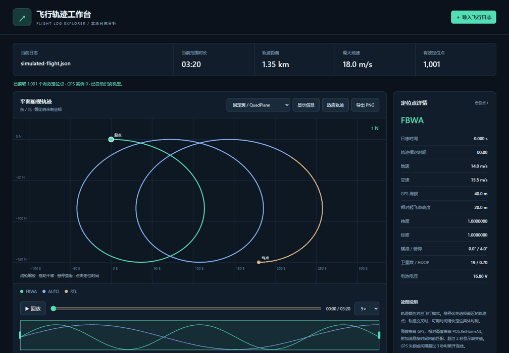
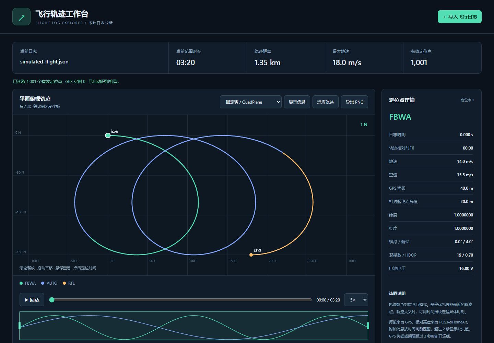
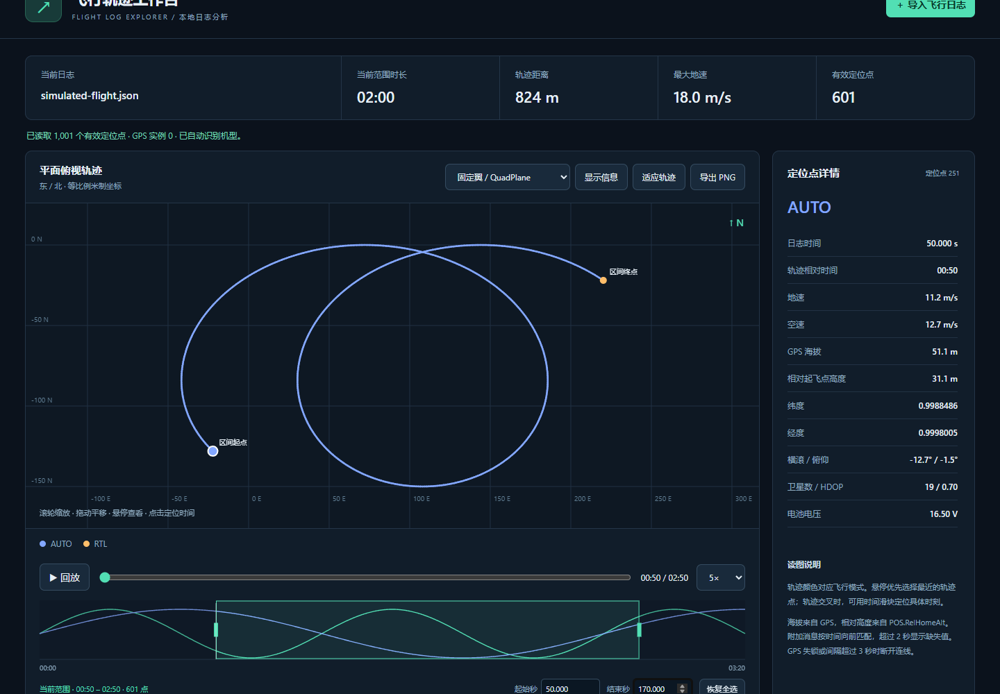
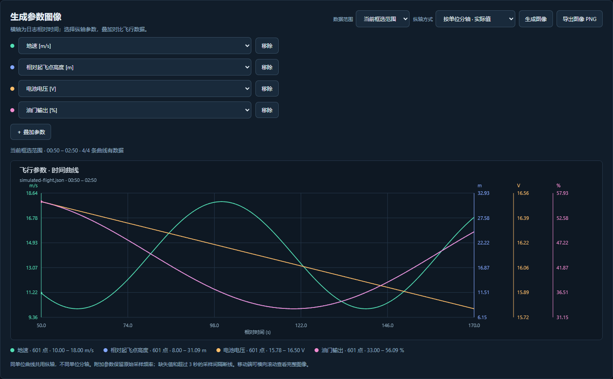

# Flight Log Explorer / (飞行日志可视化工具)

An offline, browser-based ArduPilot flight log explorer. The main branch now supports Chinese and English; the v0.4 release ZIP predates language switching.

本地离线运行的 ArduPilot 飞行日志交互工具。main 分支现已支持中英文切换；v0.4 发布包尚不包含语言切换。

[Download v0.4 / 下载 v0.4](https://github.com/hualetong/flight-log-explorer/releases/tag/v0.4) · [Release notes / 更新说明](docs/RELEASE-v0.4.md) · [MIT License / 开源许可](LICENSE)

## Preview / 功能预览

All previews use synthetic data with artificial coordinates, relative timestamps, and no device identifiers or personal information.

所有预览均使用模拟数据，坐标为人工生成，仅包含相对时间，不含真实飞行位置、设备标识或个人信息。









Try **查看示例轨迹** on the start screen, or import [simulated-flight.json](examples/simulated-flight.json). Download the JSON using GitHub's **Download raw file** button. The 200-second sample contains 1,001 GPS points, FBWA/AUTO/RTL modes, height, attitude, airspeed, battery, throttle, and vibration data. This is a demonstration fixture, not a navigation dataset.

点击启动页面的「查看示例轨迹」，或下载并导入 [simulated-flight.json](examples/simulated-flight.json)（在 GitHub 文件页点击 Download raw file）。示例包含 200 秒、1,001 个定位点、FBWA/AUTO/RTL 模式以及高度、姿态、空速、电池、油门和振动数据，仅用于演示。

## Quick start / 快速开始

Download or clone this repository, then double-click `index.html`. Click **导入飞行日志** (Import flight log), or drag a log file onto the page. No installation, server, or internet connection is required. Logs are parsed locally and are never uploaded. Use the **中文 / English** selector at the top right to switch languages. Chinese is the default; your choice is saved locally. Switching preserves the imported log, time selection and parameter choices. Charts and exported image labels follow the selected language; log field identifiers and imported text remain as recorded.

下载或克隆仓库后，双击 `index.html`。点击「导入飞行日志」，或将日志文件拖入页面。无需安装依赖、启动服务或联网；日志只在本机解析，不会上传。右上角「中文 / English」可切换语言，默认中文，选择保存在本机。切换保留当前日志、框选范围和参数选择；图表与导出图像标签跟随语言，日志字段标识及原始文字保持日志内容。

For the release ZIP, extract the entire archive first and keep the HTML, JavaScript, and CSS files together. Open the extracted `index.html` in a modern desktop browser such as Edge or Chrome.

使用 Release ZIP 时，请先完整解压，保持 HTML、JavaScript 和 CSS 文件在同一目录，再用 Edge、Chrome 等现代桌面浏览器打开 `index.html`。

## Features / 功能

| Feature | 功能说明 |
| --- | --- |
| Import ArduPilot DataFlash `.BIN` files or parsed JSON containing message arrays such as `GPS`, `MODE`, and `POS`. PX4 ULog and MAVLink tlog are not supported. | 导入 ArduPilot DataFlash `.BIN` 或包含 `GPS`、`MODE`、`POS` 等消息数组的 JSON。不支持 PX4 ULog 和 MAVLink tlog。 |
| North-up, equal-scale east/north track in meters, colored by flight mode, with start/end markers. Zoom with the wheel, drag to pan, and use **适应轨迹** to fit the track. | 北向上、等比例东/北米制轨迹，按模式着色并标记起终点。滚轮缩放、拖动平移，「适应轨迹」复位。 |
| Hover to inspect the nearest recorded point: mode, ground speed, GPS altitude, height relative to home, airspeed, coordinates, attitude, satellites, and voltage. Click to select its time. | 悬停查看最近记录点的模式、地速、GPS 海拔、相对起飞点高度、空速、经纬度、姿态、卫星和电压；点击定位时间。 |
| Time slider, playback at 1×/5×/10×, ground-speed and relative-height profiles, and PNG export. | 时间滑块、1/5/10 倍回放、地速与相对高度曲线、PNG 导出。 |
| Search and select point information with **显示信息** (Display information). Existing fields are selected by default; imported telemetry adds optional fields grouped by message and sensor instance. Selection applies to tooltips and point details and is saved locally. | 点击「显示信息」搜索并勾选字段。现有字段默认勾选；导入后提供按消息和传感器实例区分的附加字段。选择同步到悬停提示和点详情，并在本机保存。 |
| Summary of valid GPS duration, cumulative track distance, maximum ground speed, and position count. Ground/taxi records are included; takeoff and landing are not detected automatically. | 概览显示有效 GPS 时间范围、累积距离、最大地速和定位点数。包含地面滑行与静止记录，不自动识别起飞和着陆。 |

## Data interpretation / 数据口径

### Time range selection / 时间范围框选

Move within 10 CSS pixels of either green boundary on the speed/height timeline, then drag to adjust the range. The pointer changes to a horizontal resize cursor near an edge. Dragging elsewhere does not change the selection. You can also enter start/end times in seconds. Double-click the timeline or click **恢复全选** (Restore full range) to restore the complete log. Each successful import starts with the full range selected.

在地速/高度时间曲线上，光标距离绿色左右边界不超过 10 个 CSS 像素时，光标变为横向调整样式，此时可拖动调整范围；其他位置拖动不会改变范围。也可输入起始/结束秒数。双击曲线或点击「恢复全选」还原完整日志。每次成功导入均默认全选。

The track, hover targets, point details, mode legend, summary statistics, playback slider, and track PNG export are limited to the selected GPS samples. The timeline keeps the full-log time axis and all speed/height curves visible, with shading and green boundaries highlighting the active range. Overview profiles remain independently normalized against the full log. Boundaries snap to the nearest recorded GPS sample; the displayed boundary times show the actual selected samples, including when dragging across GPS gaps. A single-point selection is supported and has zero duration and distance.

轨迹、悬停目标、定位点详情、模式图例、统计、回放滑块和轨迹 PNG 导出均限定到所选 GPS 采样点。时间轴始终显示完整日志的地速/高度曲线，用遮罩和绿色边界突出选中范围；概览曲线保持按完整日志各自归一化。边界吸附到最近的 GPS 记录点，显示的是实际选中点的时间，跨 GPS 空白区框选时也遵循此规则。支持单点范围，其时长和距离为零。

### Custom parameter images / 自定义参数图像

Scroll below the track to **生成参数图像**. Select a parameter for each curve and click **＋ 叠加参数** to add up to six curves. Defaults are ground speed and height relative to home. Available numeric parameters include speed, altitude, attitude, voltage, satellites, HDOP, and the imported log's throttle, current, vibration, navigation, control, and sensor fields. Sensor instances are labeled separately.

向下滚动到「生成参数图像」。选择每条曲线的纵轴参数，点击「＋ 叠加参数」增加曲线，最多 6 条。默认显示地速与相对起飞点高度。可选数值参数包括速度、高度、姿态、电压、卫星数、HDOP，以及导入日志中的油门、电流、振动、导航、控制和传感器字段；多传感器实例分别标注。

The horizontal axis is elapsed log time in seconds. Same-unit curves share a vertical axis; different units receive separate axes with their actual values. A normalized mode maps each curve's range to 0–100% for trend comparisons (constant curves appear at 50%). Unknown-unit raw fields receive separate axes. **数据范围** defaults to the selected range and may be switched to the full GPS time span. Changing the range or configuration updates the image automatically; **生成图像** regenerates it, and **导出图像 PNG** saves the complete chart with labels and a legend.

横轴为日志相对时间（秒）。同单位共用纵轴，不同单位分别显示实际值纵轴；归一化模式将每条曲线映射到 0–100% 以比较趋势，常量曲线显示在 50%。未知单位的原始字段单独分轴。「数据范围」默认为框选范围，也可改为完整 GPS 时间范围。范围或配置变更后自动更新；「生成图像」重新生成，「导出图像 PNG」保存包含标签和图例的完整图表。

Additional message fields preserve their original sample timestamps and rates, so high-rate peaks are not resampled onto GPS points. Default common fields use the GPS-aligned point data; choose their raw message equivalents to inspect native rates. Missing values or sample gaps over three seconds break curves. Parameters without data in the chosen window are identified in the legend. On mobile, the chart can be scrolled horizontally.

附加消息字段保留原始采样时间与频率，不重采样到 GPS 点，避免遗漏高频峰值。常用默认字段使用已按 GPS 时间匹配的点数据；查看原始频率时可选择对应的原始消息字段。缺失值或超过 3 秒的采样间隔断线，范围内无数据的参数在图例标注。移动端图表支持横向滚动。

Elapsed/log timestamps remain tied to the original log. Summary duration is the difference between the selected endpoint timestamps, and distance includes only connected segments within the selection. Mode and preceding telemetry still use the original time-alignment rules so that a mode activated before the selected range remains correctly identified.

相对时间和日志时间保留原始日志基准；统计时长为所选两端时间之差，距离只累加区间内连续轨迹。模式和附加消息仍按原有时间规则匹配，因此区间开始之前切换的模式仍可正确显示。

### Display selection / 显示信息选择

The default selection contains mode, log/elapsed time, ground speed, airspeed, GPS altitude, height relative to home, coordinates, roll/pitch, satellite count/HDOP, and battery voltage. **恢复默认** restores this selection; **全部取消** hides all point information. Track coloring, summary statistics, and the speed/height profiles are independent of this selection.

默认显示模式、日志/相对时间、地速、空速、GPS 海拔、相对高度、坐标、横滚/俯仰、卫星数/HDOP 和电压。「恢复默认」恢复上述选择，「全部取消」隐藏点信息。轨迹着色、概览统计和地速/高度曲线独立于此设置。

Additional options come from timestamped numeric/text fields actually present in the imported log, including throttle, current, heading, vibration, navigation errors, mission records, and messages. Static parameters, firmware metadata, embedded files, and array payloads are excluded. Missing or stale values show `—`; a recorded zero remains zero and does not prove that a sensor is working. Unlabeled fields retain their source names and decoded values; consult the firmware's log definitions for units and enum meanings. This adds point values, not mission overlays or event timelines.

附加选项来自导入日志中实际存在、带时间戳的数值/文字字段，包括油门、电流、航向、振动、导航误差、任务记录和文字消息。静态参数、固件元数据、内嵌文件和数组载荷不在选择范围内。缺失或过期值显示「—」；日志中的 0 保留为 0，不代表传感器有效。未标注字段保留来源名称和解码值，单位及枚举含义请参考相应固件的日志定义。此功能增加点详情，不包含任务叠加图或事件时间轴。

### GPS and track continuity / GPS 与轨迹连续性

Only GPS records with `Status ≥ 3` and valid coordinates are displayed. With multiple receivers, the lowest-numbered instance with a valid fix is selected. Invalid fixes or gaps longer than 3 seconds break the track; these gaps do not contribute to distance. Logs without valid GPS points show an error instead of an inferred track.

只显示 `GPS.Status ≥ 3` 且坐标有效的记录。多个接收机时选择具有有效定位的最小编号实例，避免接收机之间交错。定位无效、失锁或间隔超过 3 秒时断开轨迹，断开段不计距离。没有有效 GPS 时提示错误，不推测位置。

### Units and time alignment / 单位与时间匹配

Speed is in m/s and altitude is in meters. `GPS.Alt` is altitude above mean sea level; `POS.RelHomeAlt` is height relative to the home position. Missing values are shown as `—`. Mode comes from the latest `MODE` event at or before the GPS sample. Other messages use the latest preceding record no more than 2 seconds old. Elapsed time starts at the first valid GPS point.

速度单位为 m/s，高度单位为 m。`GPS.Alt` 为海拔，`POS.RelHomeAlt` 为相对起飞点高度；缺失值显示「—」。模式取 GPS 采样时刻及之前最近的 `MODE` 变更；其他消息取之前最近且不超过 2 秒的记录。相对时间从首个有效 GPS 点开始。

### Flight modes / 飞行模式

Vehicle type is detected from `ArduPlane`, `ArduCopter`, or `ArduRover` in `MSG` records. If it cannot be detected, use the vehicle selector above the plot. Unknown or unmapped modes retain their numeric IDs.

根据 `MSG` 中的 `ArduPlane`、`ArduCopter` 或 `ArduRover` 自动识别机型；无法识别时，在图上方手动选择。未知模式或未覆盖的编号保留数字显示。

### Projection and profiles / 投影与曲线

The plot uses a local east/north approximation centered on the first point, suitable for flights around a field. Long-distance routes need a geographic map projection. Version 0.1 has no online basemap. Speed and relative-height profiles are normalized independently to show trends; inspect point details for exact values.

俯视图采用以首点为原点的局部东/北近似投影，适合场地飞行；长距离航线需要扩展为地理地图投影。初版没有在线地图底图。地速和相对高度曲线各自归一化显示趋势，精确值见定位点详情。

### Binary decoding / 二进制解析

BIN files are decoded using their embedded `FMT` definitions, following the field formats in [ArduPilot LogStructure.h](https://github.com/ArduPilot/ardupilot/blob/master/libraries/AP_Logger/LogStructure.h). Complete records are recovered where possible from damaged or truncated logs, with warnings.

BIN 根据内嵌 `FMT` 定义解码，字段格式参考上述 ArduPilot 源文件。日志损坏或截断时，尽可能读取完整记录并提示。

## Development / 开发

| File / 文件 | Purpose / 用途 |
| --- | --- |
| `index.html` | Application entry / 工具入口 |
| `log-parser.js` | DataFlash decoding and time alignment / DataFlash 解码与时间关联 |
| `app.js` | Canvas rendering, interactions, and import / Canvas 绘图、交互与导入 |
| `charts.js` | Custom parameter charts and PNG export / 自定义参数图像及 PNG 导出 |
| `style.css` | Interface styling / 界面样式 |
| `test-parser.cjs` | Parser verification / 解析验证 |
| `check-ui.cjs` | Browser interaction verification / 浏览器交互验证 |
| `check-charts.cjs` | Timeline context and parameter chart verification / 全时间轴与参数图像验证 |
| `i18n.js` | UI and canvas localization / 界面与图像文字翻译 |
| `check-language.cjs` | Language persistence and state preservation checks / 语言记忆与状态保留验证 |

An inline Web Worker runs parsing in the background, including when opened directly from disk. Older browsers without Web Worker support fall back to the main thread. Runtime use requires no development dependencies.

内联 Web Worker 在后台解析，直接双击打开也无需网络资源；不支持 Web Worker 的旧浏览器回退到主线程。正常使用工具不需要开发依赖。

## Verification / 验证

Run from the repository directory / 在仓库目录运行：

```sh
node test-parser.cjs
```

This checks invalid GPS, fix-loss gaps, time alignment, and stale data. Optional real-log comparisons run when the original log75/log76/log77 fixtures and parsed JSON exist in `../10.1`, or in the directory specified by `FLIGHT_LOG_DIR`. Real flight logs are not distributed with this repository. The original log77 fixture named `noGPS` actually contains 274 valid GPS records and is displayed accordingly.

检查无有效 GPS、失锁断线、时间匹配和过期数据。若 `../10.1` 或环境变量 `FLIGHT_LOG_DIR` 指定的目录包含原始 log75/log76/log77 和解析 JSON，还会执行真实日志对照验证。真实飞行日志不随仓库分发。原始文件名含 `noGPS` 的 log77 实际有 274 个有效 GPS 记录，按内容正常展示。

For browser checks / 浏览器验证：

```sh
npm install --no-save playwright
npx playwright install chromium
node check-ui.cjs
node check-charts.cjs
node check-language.cjs
```

Checks use the simulated example by default. Set `BROWSER_CHANNEL=msedge` to use an installed Microsoft Edge, or `FLIGHT_LOG_DIR` to test the original BIN fixture. These checks cover hover, click, zoom, seeking, playback, PNG export, import-error handling, and mobile layout.

默认使用模拟示例验证。设置 `BROWSER_CHANNEL=msedge` 可使用已安装的 Edge；设置 `FLIGHT_LOG_DIR` 可验证原始 BIN。检查涵盖悬停、点击、缩放、时间定位、回放、PNG 导出、导入错误处理和移动端布局。

## License and feedback / 许可与反馈

Released under the [MIT License](LICENSE). Feedback and contributions are welcome through [GitHub Issues](https://github.com/hualetong/flight-log-explorer/issues) and pull requests. When reporting an issue, include your browser, firmware/log format, and steps to reproduce; share synthetic or sanitized logs where possible.

项目采用 [MIT 许可](LICENSE)，欢迎通过 [GitHub Issues](https://github.com/hualetong/flight-log-explorer/issues) 和 Pull Request 反馈与贡献。反馈时请提供浏览器、固件/日志格式和复现步骤；示例日志建议使用模拟或脱敏数据。
