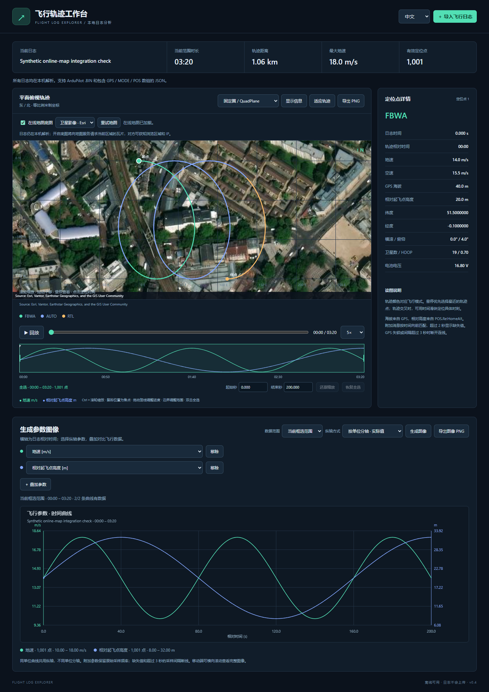
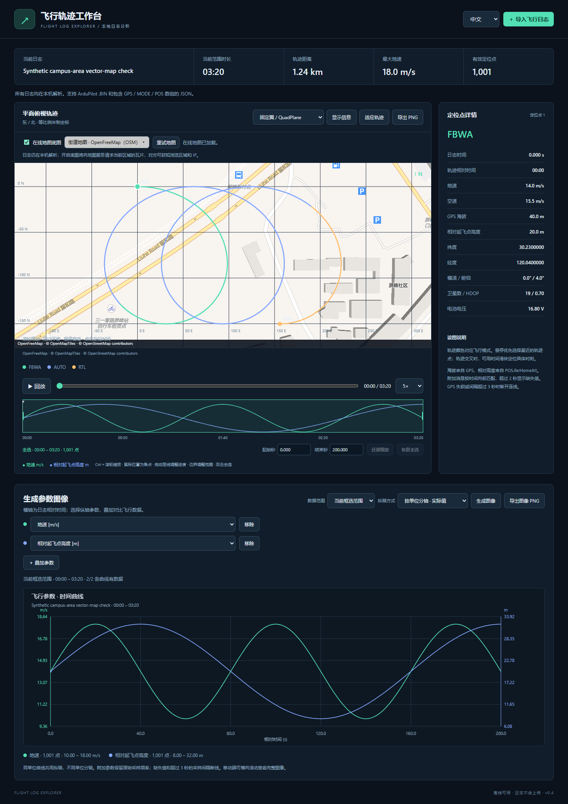

# Flight Log Explorer / (飞行日志可视化工具)

An offline-capable, browser-based ArduPilot flight log explorer with optional online basemaps. The v0.5 release includes Chinese/English, timeline zoom and online maps.

本地离线运行、可选联网底图的 ArduPilot 飞行日志交互工具。v0.5 发布包已包含中英文切换、时间轴缩放和在线地图。

The main branch additionally supports `.waypoints` mission overlays; this feature is not included in the v0.5 release ZIP.

main 分支新增 `.waypoints` 任务航点叠加；v0.5 发布 ZIP 尚不包含此功能。

[Download v0.5 / 下载 v0.5](https://github.com/hualetong/flight-log-explorer/releases/tag/v0.5) · [Release notes / 更新说明](docs/RELEASE-v0.5.md) · [MIT License / 开源许可](LICENSE)

## Preview / 功能预览

All previews use synthetic data with artificial coordinates, relative timestamps, and no device identifiers or personal information.

所有预览均使用模拟数据，坐标为人工生成，仅包含相对时间，不含真实飞行位置、设备标识或个人信息。


Synthetic flight over a generic demonstration location, with optional online imagery / 人工生成的示例轨迹与在线卫星影像叠加：



OpenFreeMap streets and buildings with a synthetic campus-area track / OpenFreeMap 道路、建筑与校区附近人工轨迹（非真实飞行）：



Try **查看示例轨迹** on the start screen, or import [simulated-flight.json](examples/simulated-flight.json). Download the JSON using GitHub's **Download raw file** button. The 200-second sample contains 1,001 GPS points, FBWA/AUTO/RTL modes, height, attitude, airspeed, battery, throttle, and vibration data. This is a demonstration fixture, not a navigation dataset.

点击启动页面的「查看示例轨迹」，或下载并导入 [simulated-flight.json](examples/simulated-flight.json)（在 GitHub 文件页点击 Download raw file）。示例包含 200 秒、1,001 个定位点、FBWA/AUTO/RTL 模式以及高度、姿态、空速、电池、油门和振动数据，仅用于演示。

## Quick start / 快速开始

Download or clone this repository, then double-click `index.html`. Click **导入飞行日志** (Import flight log), or drag a log file onto the page. No installation, server, or internet connection is required. Logs are parsed locally and are never uploaded. Use the **中文 / English** selector at the top right to switch languages. Chinese is the default; your choice is saved locally. Switching preserves the imported log, time selection and parameter choices. Charts and exported image labels follow the selected language; log field identifiers and imported text remain as recorded.

下载或克隆仓库后，双击 `index.html`。点击「导入飞行日志」，或将日志文件拖入页面。无需安装依赖、启动服务或联网；日志只在本机解析，不会上传。右上角「中文 / English」可切换语言，默认中文，选择保存在本机。切换保留当前日志、框选范围和参数选择；图表与导出图像标签跟随语言，日志字段标识及原始文字保持日志内容。

For the release ZIP, extract the entire archive first and keep the HTML, JavaScript, and CSS files together. Open the extracted `index.html` in a modern desktop browser such as Edge or Chrome.

使用 Release ZIP 时，请先完整解压，保持 HTML、JavaScript 和 CSS 文件在同一目录，再用 Edge、Chrome 等现代桌面浏览器打开 `index.html`。

## Features / 功能

| Feature | 功能说明 |
| --- | --- |
| Overlay a QGC WPL 110 `.waypoints` mission with numbered markers, order lines, item inspection and PNG export (main branch). | 叠加 QGC WPL 110 `.waypoints` 任务，显示编号、任务顺序示意线、任务项详情并包含在 PNG 中（main 分支）。 |
| Optional Esri satellite/street maps or OpenFreeMap (OSM) vector streets beneath the mode-colored track; pan, zoom, hover, time filtering and PNG export remain available. | 可选 Esri 卫星/街道地图或 OpenFreeMap（OSM）矢量街道图，与模式着色轨迹叠加，继续支持平移、缩放、悬停、时间筛选和 PNG 导出。 |
| Import ArduPilot DataFlash `.BIN` files or parsed JSON containing message arrays such as `GPS`, `MODE`, and `POS`. PX4 ULog and MAVLink tlog are not supported. | 导入 ArduPilot DataFlash `.BIN` 或包含 `GPS`、`MODE`、`POS` 等消息数组的 JSON。不支持 PX4 ULog 和 MAVLink tlog。 |
| North-up, equal-scale east/north track in meters, colored by flight mode, with start/end markers. Zoom with the wheel, drag to pan, and use **适应轨迹** to fit the track. | 北向上、等比例东/北米制轨迹，按模式着色并标记起终点。滚轮缩放、拖动平移，「适应轨迹」复位。 |
| Hover to inspect the nearest recorded point: mode, ground speed, GPS altitude, height relative to home, airspeed, coordinates, attitude, satellites, and voltage. Click to select its time. | 悬停查看最近记录点的模式、地速、GPS 海拔、相对起飞点高度、空速、经纬度、姿态、卫星和电压；点击定位时间。 |
| Time slider, playback at 1×/5×/10×, ground-speed and relative-height profiles, and PNG export. | 时间滑块、1/5/10 倍回放、地速与相对高度曲线、PNG 导出。 |
| Search and select point information with **显示信息** (Display information). Existing fields are selected by default; imported telemetry adds optional fields grouped by message and sensor instance. Selection applies to tooltips and point details and is saved locally. | 点击「显示信息」搜索并勾选字段。现有字段默认勾选；导入后提供按消息和传感器实例区分的附加字段。选择同步到悬停提示和点详情，并在本机保存。 |
| Summary of valid GPS duration, cumulative track distance, maximum ground speed, and position count. Ground/taxi records are included; takeoff and landing are not detected automatically. | 概览显示有效 GPS 时间范围、累积距离、最大地速和定位点数。包含地面滑行与静止记录，不自动识别起飞和着陆。 |

## Data interpretation / 数据口径

### Track display height / 轨迹显示高度

The track area grows with the viewport: desktop defaults to 75% of window height, between 620 and 1,000 pixels. Mobile uses a smaller responsive default. Use **显示高度 / Display height** above the plot to choose 400–1,400 pixels; the setting is saved locally. **恢复默认高度 / Reset height** restores automatic sizing. Resizing redraws the canvas, basemap and waypoints while preserving the selected time range and playback position.

轨迹区随窗口高度增高：桌面默认使用窗口高度的 75%，限制在 620～1000 像素，移动端使用较小的自适应高度。图上方「显示高度」可手动选择 400～1400 像素并保存在本机；「恢复默认高度」恢复自动尺寸。调整后重新绘制画布、底图与航点，保留框选时间范围及当前进度。

### Mission waypoint overlay / 任务航点叠加

Import your flight log, then click **＋ 导入航点 / Import waypoints** above the track to select a `.waypoints` file. Dragging a waypoint file onto the page also works; you can drop a log and waypoint file together. Files use the [QGC WPL 110 plain-text mission format](https://mavlink.io/en/file_formats/), commonly exported by Mission Planner. A waypoint file imported before the log waits until valid GPS data is available. Parsing stays local and does not enable online maps.

先导入飞行日志，再点击轨迹上方「＋ 导入航点」选择 `.waypoints` 文件；也支持拖入，或同时拖入日志与航点文件。支持 Mission Planner 常用的 QGC WPL 110 文本任务格式。先导入航点时，会等待日志提供有效 GPS 后叠加。文件只在本机读取，不会自动开启在线地图。

Yellow diamonds label the original mission sequence numbers (`WP 1`, `WP 2`, etc.); a sequence-zero `NAV_WAYPOINT` is treated as the file's Home and shown separately. Dashed lines connect supported navigation positions in mission order, skipping non-navigation DO items. These lines illustrate order, not the aircraft's predicted flight path: splines, loiter circles, turns, jumps, conditional behavior and RTL are not simulated. Missing navigation positions and jumps break the line. Home is not connected to the first mission point.

黄色菱形保留文件中的任务序号（WP 1、WP 2 等）；序号 0 的 `NAV_WAYPOINT` 作为文件 Home 单独标记。虚线按任务顺序连接支持的导航位置，跳过普通 DO 指令，仅表示顺序；不模拟样条、盘旋、转弯、跳转、条件行为或 RTL 的实际航线。未指定位置的导航项与跳转指令会断开示意连线；Home 不与首个任务点连线。

Hover over a diamond to inspect its command, coordinates, frame, altitude, parameters and file flags. Click it to keep the item selected, or select any item in **航点详情 / Waypoint details**, including commands without positions. Altitude values retain their frame: MSL, relative to the mission Home, or above terrain. They are not converted to GPS altitude or relative to the first flight-log point. The file's Current flag is shown as recorded and does not indicate the aircraft's live progress.

悬停菱形查看命令、经纬度、坐标系、高度、参数和文件标记；点击固定选择，也可在「航点详情」下拉菜单查看所有任务项，包括不含位置的指令。高度保留原始坐标系口径（海拔、相对任务 Home、地形以上高度），不转换为 GPS 海拔或相对日志首点高度。Current 标记保留文件值，不代表飞机当前执行进度。

Use **显示航点 / Show waypoints**, **清除航点 / Clear waypoints**, and **适应轨迹与航点 / Fit track and waypoints** to manage the overlay. Flight time selection filters only recorded flight data; the complete mission remains visible and does not affect log statistics or playback. Offline and online projections share the same GPS coordinates. Track PNG export includes visible waypoint markers and lines. A new waypoint file replaces the previous overlay; an invalid file retains it. Importing a new log keeps the loaded mission for comparison; clear or replace it when changing missions.

通过「显示航点」「清除航点」「适应轨迹与航点」管理叠加。时间范围只筛选日志数据，完整任务仍保持显示，不参与日志统计或回放；离线图与在线底图使用一致的 GPS 坐标叠加。轨迹 PNG 包含当前可见的航点与连线。新航点文件替换旧叠加，导入失败保留旧任务；更换日志时保留已载入任务，切换任务时请清除或替换。

Supported plotted navigation commands are waypoint, loiter, land, takeoff, loiter-to-altitude, arc waypoint, spline waypoint, VTOL takeoff/land and payload place, in global frames 0/3/5/6/10/11. Coordinates in this text format are decimal degrees, including frames named `_INT`. Local frames, unknown commands, non-navigation positions and unspecified (`NaN` or both latitude/longitude zero) positions appear only in the inspector. This version supports one overlay, not `.plan`, geofences or rally files. Try [simulated-flight.waypoints](examples/simulated-flight.waypoints) with the built-in flight example; all coordinates are artificial.

可绘制的导航命令包括普通航点、盘旋、降落、起飞、盘旋至指定高度、圆弧航点、样条航点、VTOL 起降和投放位置，坐标系支持 0/3/5/6/10/11。文本文件经纬度按十进制度读取，包括名称含 `_INT` 的坐标系。局部坐标、未知命令、非导航位置及未指定位置（NaN 或经纬度同时为 0）仅在详情中显示。当前支持单个任务叠加，不支持 `.plan`、围栏或集结点文件。可配合内置飞行示例导入上方模拟航点文件，坐标均为人工生成。

### Time range selection / 时间范围框选

Move within 10 CSS pixels of either green boundary on the speed/height timeline, then drag to adjust the range. The pointer changes to a horizontal resize cursor near an edge. Dragging elsewhere does not change the selection. You can also enter start/end times in seconds. Double-click the timeline or click **恢复全选** (Restore full range) to restore the complete log. Each successful import starts with the full range selected.

在地速/高度时间曲线上，光标距离绿色左右边界不超过 10 个 CSS 像素时，光标变为横向调整样式，此时可拖动调整范围；其他位置拖动不会改变范围。也可输入起始/结束秒数。双击曲线或点击「恢复全选」还原完整日志。每次成功导入均默认全选。

Drag the white vertical playhead to seek within the selected range. The pointer becomes a grab cursor within 8 CSS pixels of the line; dragging pauses playback and updates the track marker, slider and point details. If the playhead overlaps a green range edge, use the small triangle at the top to seek, or the green handle area to adjust the range.

拖动白色时间竖线可调整当前范围内的进度。距离竖线不超过 8 个 CSS 像素时显示抓取光标，拖动暂停回放，并同步更新轨迹定位点、滑块与详情。竖线与绿色边界重叠时，拖动顶部小三角调整进度，拖动绿色手柄区域调整范围。

Hold **Ctrl** and scroll over the timeline to zoom in/out around the time under the pointer. Zoom changes only the visible time window, preserving the selected range, playback position and parameter charts. Visible boundaries and the playhead remain draggable at the new scale. Use **还原缩放 / Reset zoom** to restore the full timeline; importing a new log also resets zoom. Without Ctrl, the wheel scrolls the page normally.

在时间轴上按住 **Ctrl** 滚动滚轮，可围绕鼠标所在时间点放大或缩小。缩放仅改变可见时间窗口，保留框选范围、进度及参数图像；可见边界和进度竖线仍可按新比例拖动。点击「还原缩放」恢复完整时间轴，导入新日志也会还原缩放。未按 Ctrl 时，滚轮正常滚动页面。

The track, hover targets, point details, mode legend, summary statistics, playback slider, and track PNG export are limited to the selected GPS samples. By default, the timeline shows the full log and all speed/height curves, with shading and green boundaries highlighting the active range. Ctrl-wheel zoom changes the visible time window independently. Overview profiles remain independently normalized against the full log. Boundaries snap to the nearest recorded GPS sample; the displayed boundary times show the actual selected samples, including when dragging across GPS gaps. A single-point selection is supported and has zero duration and distance.

轨迹、悬停目标、定位点详情、模式图例、统计、回放滑块和轨迹 PNG 导出均限定到所选 GPS 采样点。时间轴默认显示完整日志的地速/高度曲线，用遮罩和绿色边界突出选中范围；Ctrl＋滚轮可独立调整可见时间窗口；概览曲线保持按完整日志各自归一化。边界吸附到最近的 GPS 记录点，显示的是实际选中点的时间，跨 GPS 空白区框选时也遵循此规则。支持单点范围，其时长和距离为零。

### Custom parameter images / 自定义参数图像

Scroll below the track to **生成参数图像**. Select a parameter for each curve and click **＋ 叠加参数** to add up to six curves. Defaults are ground speed and height relative to home. Available numeric parameters include speed, altitude, attitude, voltage, satellites, HDOP, and the imported log's throttle, current, vibration, navigation, control, and sensor fields. Sensor instances are labeled separately.

向下滚动到「生成参数图像」。选择每条曲线的纵轴参数，点击「＋ 叠加参数」增加曲线，最多 6 条。默认显示地速与相对起飞点高度。可选数值参数包括速度、高度、姿态、电压、卫星数、HDOP，以及导入日志中的油门、电流、振动、导航、控制和传感器字段；多传感器实例分别标注。

The horizontal axis is elapsed log time in seconds. Same-unit curves share a vertical axis; different units receive separate axes with their actual values. A normalized mode maps each curve's range to 0–100% for trend comparisons (constant curves appear at 50%). Unknown-unit raw fields receive separate axes. **数据范围** defaults to the selected range and may be switched to the full GPS time span. Changing the range or configuration updates the image automatically; **生成图像** regenerates it, and **导出图像 PNG** saves the complete chart with labels and a legend.

横轴为日志相对时间（秒）。同单位共用纵轴，不同单位分别显示实际值纵轴；归一化模式将每条曲线映射到 0–100% 以比较趋势，常量曲线显示在 50%。未知单位的原始字段单独分轴。「数据范围」默认为框选范围，也可改为完整 GPS 时间范围。范围或配置变更后自动更新；「生成图像」重新生成，「导出图像 PNG」保存包含标签和图例的完整图表。

Additional message fields preserve their original sample timestamps and rates, so high-rate peaks are not resampled onto GPS points. Default common fields use the GPS-aligned point data; choose their raw message equivalents to inspect native rates. Missing values or sample gaps over three seconds break curves. Parameters without data in the chosen window are identified in the legend. On mobile, the chart can be scrolled horizontally.

附加消息字段保留原始采样时间与频率，不重采样到 GPS 点，避免遗漏高频峰值。常用默认字段使用已按 GPS 时间匹配的点数据；查看原始频率时可选择对应的原始消息字段。缺失值或超过 3 秒的采样间隔断线，范围内无数据的参数在图例标注。移动端图表支持横向滚动。

Elapsed/log timestamps remain tied to the original log. Summary duration is the difference between the selected endpoint timestamps, and distance includes only connected segments within the selection. Mode and preceding telemetry still use the original time-alignment rules so that a mode activated before the selected range remains correctly identified.

相对时间和日志时间保留原始日志基准；统计时长为所选两端时间之差，距离只累加区间内连续轨迹。模式和附加消息仍按原有时间规则匹配，因此区间开始之前切换的模式仍可正确显示。

### Display selection / 显示信息选择

The default selection contains mode, log/elapsed time, ground speed, airspeed, GPS altitude, height relative to home, coordinates, roll/pitch, satellite count/HDOP, and battery voltage. **恢复默认** restores this selection; **全部取消** hides all point information. Track coloring, summary statistics, and the speed/height profiles are independent of this selection.

默认显示模式、日志/相对时间、地速、空速、GPS 海拔、相对高度、坐标、横滚/俯仰、卫星数/HDOP 和电压。「恢复默认」恢复上述选择，「全部取消」隐藏点信息。轨迹着色、概览统计和地速/高度曲线独立于此设置。

Additional options come from timestamped numeric/text fields actually present in the imported log, including throttle, current, heading, vibration, navigation errors, mission records, and messages. Static parameters, firmware metadata, embedded files, and array payloads are excluded. Missing or stale values show `—`; a recorded zero remains zero and does not prove that a sensor is working. Unlabeled fields retain their source names and decoded values; consult the firmware's log definitions for units and enum meanings. This adds point values, not mission overlays or event timelines.

附加选项来自导入日志中实际存在、带时间戳的数值/文字字段，包括油门、电流、航向、振动、导航误差、任务记录和文字消息。静态参数、固件元数据、内嵌文件和数组载荷不在选择范围内。缺失或过期值显示「—」；日志中的 0 保留为 0，不代表传感器有效。未标注字段保留来源名称和解码值，单位及枚举含义请参考相应固件的日志定义。此功能增加点详情，不包含任务叠加图或事件时间轴。

### GPS and track continuity / GPS 与轨迹连续性

Only GPS records with `Status ≥ 3` and valid coordinates are displayed. With multiple receivers, the lowest-numbered instance with a valid fix is selected. Invalid fixes or gaps longer than 3 seconds break the track; these gaps do not contribute to distance. Logs without valid GPS points show an error instead of an inferred track.

只显示 `GPS.Status ≥ 3` 且坐标有效的记录。多个接收机时选择具有有效定位的最小编号实例，避免接收机之间交错。定位无效、失锁或间隔超过 3 秒时断开轨迹，断开段不计距离。没有有效 GPS 时提示错误，不推测位置。

### Units and time alignment / 单位与时间匹配

Speed is in m/s and altitude is in meters. `GPS.Alt` is altitude above mean sea level; `POS.RelHomeAlt` is height relative to the home position. Missing values are shown as `—`. Mode comes from the latest `MODE` event at or before the GPS sample. Other messages use the latest preceding record no more than 2 seconds old. Elapsed time starts at the first valid GPS point.

速度单位为 m/s，高度单位为 m。`GPS.Alt` 为海拔，`POS.RelHomeAlt` 为相对起飞点高度；缺失值显示「—」。模式取 GPS 采样时刻及之前最近的 `MODE` 变更；其他消息取之前最近且不超过 2 秒的记录。相对时间从首个有效 GPS 点开始。

### Flight modes / 飞行模式

Vehicle type is detected from `ArduPlane`, `ArduCopter`, or `ArduRover` in `MSG` records. If it cannot be detected, use the vehicle selector above the plot. Unknown or unmapped modes retain their numeric IDs.

根据 `MSG` 中的 `ArduPlane`、`ArduCopter` 或 `ArduRover` 自动识别机型；无法识别时，在图上方手动选择。未知模式或未覆盖的编号保留数字显示。

### Online basemap / 在线地图底图

Above the track, enable **在线地图底图 / Online basemap**, then choose Esri satellite imagery, Esri streets, or **Street map · OpenFreeMap (OSM)**. The menu highlights the selected source with a light background and dark text; other sources use a dark background and light text. Maps are off by default on every page load; no external requests are made while maps are off. Visible areas are loaded on demand with an in-memory cache. Failed loading leaves the track usable and can be retried. Turning the basemap off restores the offline grid. Cached Esri tiles may remain visible after a connection loss; OpenFreeMap retains a snapshot of the current view until the view changes. Uncached areas need internet access.

在轨迹上方勾选「在线地图底图」，可选择 Esri 卫星影像、Esri 街道地图或「街道地图 · OpenFreeMap（OSM）」。菜单选中项为浅底深字，未选中项为深底浅字。每次打开页面默认关闭底图，关闭时不发送地图请求；按需加载可见区域并使用内存缓存。加载失败时轨迹仍可操作，可点击「重试地图」。关闭底图恢复离线网格。断网后已缓存的 Esri 瓦片可以继续显示，OpenFreeMap 保留当前视图快照直到视图改变；未缓存区域需要网络。

OpenFreeMap uses OpenStreetMap vector data and requires no API key. It provides another source of roads and buildings where Esri's detailed street tiles are missing; coverage depends on OSM data. The locally bundled MapLibre renderer works when `index.html` is opened directly from disk and requires WebGL. Style, tiles, fonts and sprites are fetched only after opting in. See the [OpenFreeMap quick start](https://openfreemap.org/quick_start/) and [service terms](https://openfreemap.org/tos/).

OpenFreeMap 使用 OpenStreetMap 矢量数据，无需 API 密钥；在 Esri 缺少详细街道瓦片的区域，可切换它查看另一套道路和建筑数据，具体覆盖取决于 OSM 数据。本地附带的 MapLibre 渲染器支持直接双击 `index.html`，需要浏览器支持 WebGL；仅在开启此底图后联网获取样式、瓦片、字体和图标。详情见上方 OpenFreeMap 使用文档与服务条款。

**Privacy:** log files, full coordinates and telemetry arrays are not uploaded. Enabling Esri maps sends tile requests to `server.arcgisonline.com`; OpenFreeMap requests go to `tiles.openfreemap.org`. Tile indices identify the viewed geographic area, and providers can see your IP and normal request metadata. Leave maps off to retain fully offline operation.

**隐私：**不会上传日志文件、完整经纬度列表或遥测数组。Esri 请求发送至 `server.arcgisonline.com`，OpenFreeMap 请求发送至 `tiles.openfreemap.org`；瓦片索引可反映正在浏览的地理区域，服务方可获知 IP 和普通请求信息。如需全程离线，请保持底图关闭。

Tiles come from Esri's public [World Imagery](https://server.arcgisonline.com/ArcGIS/rest/services/World_Imagery/MapServer) and [World Street Map](https://server.arcgisonline.com/ArcGIS/rest/services/World_Street_Map/MapServer) services. Source attribution is visible on the map and in exported PNGs, following [Esri attribution guidance](https://doc.arcgis.com/en/arcgis-online/reference/display-copyrights.htm). The project's MIT license covers project code; map imagery remains subject to [Esri service terms](https://www.esri.com/en-us/legal/terms/web-site-service) and its data providers' rights. No bulk tile download or offline map package is provided.

底图来自 Esri 公共 World Imagery / World Street Map 服务，地图及 PNG 均显示来源署名。项目 MIT 许可适用于项目代码，地图影像遵循 Esri 服务条款及其数据供应商的权利；不提供批量下载或离线地图包。

Satellite imagery and street maps have different detailed coverage. Some areas have no street tiles at high zoom levels, even if imagery is available. Requests use `blankTile=false` to distinguish missing tiles from placeholder images, as documented by [Esri's Map Tile API](https://developers.arcgis.com/rest/services-reference/enterprise/map-tile/). Missing/unavailable tiles automatically use the corresponding cropped parent tile at a lower resolution, checking at most eight parent levels. This also handles missing-tile responses whose absent CORS headers prevent reading their HTTP status. Track zoom, coordinates, selection and progress stay unchanged, and a status message explains the reduced basemap detail. If parent tiles are also unavailable, use the retry flow.

卫星影像与街道图的详细级别覆盖不同，某些地区即使有卫星影像，也没有高缩放级别街道瓦片。请求通过 `blankTile=false` 区分缺失瓦片与占位图片；缺失或不可用时自动使用低级别父瓦片的对应裁剪区域，最多检查八个父级，同时处理缺失响应没有 CORS 头而无法读取 HTTP 状态的情况。保持轨迹缩放、坐标、范围与进度不变，并提示底图细节受限。父级也不可用时可通过「重试地图」重试。放大低级别瓦片无法增加服务本身没有提供的街道细节。

### Projection and profiles / 投影与曲线

The offline plot uses a local east/north approximation centered on the first point, suitable for flights around a field. Online maps use the same WGS84 GPS coordinates projected to Web Mercator, with longitude wrapping for crossing the date line. Map and track share one transform, so pan/zoom and hover stay aligned. Mercator clamps latitude to ±85.0511°; the plotted meter grid is scaled at the first point and is approximate away from it. Distance statistics retain the original local GPS calculation. Speed and relative-height profiles are normalized independently to show trends; inspect point details for exact values.

离线俯视图采用以首点为原点的局部东/北近似投影，适合场地飞行。在线地图将相同 WGS84 GPS 坐标投影到 Web Mercator，跨日期变更线时处理经度回绕；地图和轨迹共用坐标变换，平移、缩放和悬停保持对齐。Mercator 纬度限制为 ±85.0511°；米制网格按首点纬度换算，远离首点时为近似值。距离统计仍采用原有局部 GPS 计算。地速和相对高度曲线各自归一化显示趋势，精确值见定位点详情。

### Binary decoding / 二进制解析

BIN files are decoded using their embedded `FMT` definitions, following the field formats in [ArduPilot LogStructure.h](https://github.com/ArduPilot/ardupilot/blob/master/libraries/AP_Logger/LogStructure.h). Complete records are recovered where possible from damaged or truncated logs, with warnings.

BIN 根据内嵌 `FMT` 定义解码，字段格式参考上述 ArduPilot 源文件。日志损坏或截断时，尽可能读取完整记录并提示。

## Development / 开发

| File / 文件 | Purpose / 用途 |
| --- | --- |
| `index.html` | Application entry / 工具入口 |
| `log-parser.js` | DataFlash decoding and time alignment / DataFlash 解码与时间关联 |
| `app.js` | Canvas rendering, interactions, and import / Canvas 绘图、交互与导入 |
| `charts.js` | Custom parameter charts and PNG export / 自定义参数图像及 PNG 导出 |
| `style.css` | Interface styling / 界面样式 |
| `plot-layout.js` / `check-plot-layout.cjs` | Responsive/persistent track height and layout checks / 自适应轨迹高度、设置记忆及布局验证 |
| `test-parser.cjs` | Parser verification / 解析验证 |
| `check-ui.cjs` | Browser interaction verification / 浏览器交互验证 |
| `check-charts.cjs` | Timeline context and parameter chart verification / 全时间轴与参数图像验证 |
| `i18n.js` | UI and canvas localization / 界面与图像文字翻译 |
| `check-language.cjs` | Language persistence and state preservation checks / 语言记忆与状态保留验证 |
| `check-playhead.cjs` | Playhead dragging and range clamping checks / 进度竖线拖动与范围限制验证 |
| `check-timeline-zoom.cjs` | Pointer-anchored timeline zoom and zoomed dragging checks / 鼠标焦点时间轴缩放与拖动验证 |
| `check-timeline-edges.cjs` | Endpoint dragging at fractional widths / 小数宽度下的左右边界拖动验证 |
| `online-map.js` | Optional raster tiles and Mercator overlay / 可选栅格底图与 Mercator 叠加 |
| `waypoint-parser.js` / `waypoint-overlay.js` | WPL 110 mission parsing, overlay and item inspection / WPL 110 解析、航点叠加与任务详情 |
| `test-waypoints.cjs` / `check-waypoints.cjs` | Mission semantics, validation and overlay interactions / 任务语义、文件校验和叠加交互验证 |
| `vector-map.js` | Opt-in OpenFreeMap rendering and canvas composition / 可选 OpenFreeMap 渲染与画布叠加 |
| `map-picker.js` | Accessible map source menu with consistent colors / 支持键盘、配色一致的地图源菜单 |
| `vendor/maplibre/` | Locally bundled MapLibre GL JS 5.24.0 and third-party licenses / 本地 MapLibre GL JS 5.24.0 与第三方许可 |
| `check-map.cjs` | Opt-in loading, projection, export, retry and offline checks with mock tiles / 模拟瓦片验证可选加载、投影、导出、重试及断网 |
| `check-map-fallback.cjs` | Missing detailed tiles and parent-tile crop fallback / 详细瓦片缺失与父级裁剪回退验证 |
| `check-vector-map.cjs` | Mock vector map alignment/export/offline/retry and source menu interactions / 模拟矢量地图对齐、导出、断网、重试及地图菜单交互验证 |

An inline Web Worker runs parsing in the background, including when opened directly from disk. Older browsers without Web Worker support fall back to the main thread. Runtime use requires no development dependencies.

内联 Web Worker 在后台解析，直接双击打开也无需网络资源；不支持 Web Worker 的旧浏览器回退到主线程。正常使用工具不需要开发依赖。

## Verification / 验证

Run from the repository directory / 在仓库目录运行：

```sh
node test-parser.cjs
node test-waypoints.cjs
```

This checks invalid GPS, fix-loss gaps, time alignment, and stale data. Optional real-log comparisons run when the original log75/log76/log77 fixtures and parsed JSON exist in `../10.1`, or in the directory specified by `FLIGHT_LOG_DIR`. Real flight logs are not distributed with this repository. The original log77 fixture named `noGPS` actually contains 274 valid GPS records and is displayed accordingly.

检查无有效 GPS、失锁断线、时间匹配和过期数据。若 `../10.1` 或环境变量 `FLIGHT_LOG_DIR` 指定的目录包含原始 log75/log76/log77 和解析 JSON，还会执行真实日志对照验证。真实飞行日志不随仓库分发。原始文件名含 `noGPS` 的 log77 实际有 274 个有效 GPS 记录，按内容正常展示。

For browser checks / 浏览器验证：

```sh
npm install --no-save playwright
npx playwright install chromium
node check-ui.cjs
node check-charts.cjs
node check-language.cjs
node check-playhead.cjs
node check-timeline-zoom.cjs
node check-timeline-edges.cjs
node check-map.cjs
node check-map-fallback.cjs
node check-vector-map.cjs
node check-waypoints.cjs
node check-plot-layout.cjs
```

Checks use the simulated example by default. Set `BROWSER_CHANNEL=msedge` to use an installed Microsoft Edge, or `FLIGHT_LOG_DIR` to test the original BIN fixture. These checks cover hover, click, zoom, seeking, playback, PNG export, import-error handling, and mobile layout.

默认使用模拟示例验证。设置 `BROWSER_CHANNEL=msedge` 可使用已安装的 Edge；设置 `FLIGHT_LOG_DIR` 可验证原始 BIN。检查涵盖悬停、点击、缩放、时间定位、回放、PNG 导出、导入错误处理和移动端布局。

## License and feedback / 许可与反馈

Released under the [MIT License](LICENSE). Feedback and contributions are welcome through [GitHub Issues](https://github.com/hualetong/flight-log-explorer/issues) and pull requests. When reporting an issue, include your browser, firmware/log format, and steps to reproduce; share synthetic or sanitized logs where possible.

Bundled MapLibre GL JS is licensed under BSD-3-Clause; its license and dependency notices are retained in [vendor/maplibre/LICENSE.txt](vendor/maplibre/LICENSE.txt). OpenFreeMap map data attribution appears on the track and exported PNG: OpenFreeMap, © OpenMapTiles, © OpenStreetMap contributors. Map data is subject to its own licenses and service terms.

项目采用 [MIT 许可](LICENSE)，欢迎通过 [GitHub Issues](https://github.com/hualetong/flight-log-explorer/issues) 和 Pull Request 反馈与贡献。反馈时请提供浏览器、固件/日志格式和复现步骤；示例日志建议使用模拟或脱敏数据。

附带的 MapLibre GL JS 使用 BSD-3-Clause 许可，其许可及依赖声明保存在上述第三方许可文件中。OpenFreeMap 底图及 PNG 导出保留 OpenFreeMap、© OpenMapTiles、© OpenStreetMap contributors 署名；地图数据遵循各自许可及服务条款。
